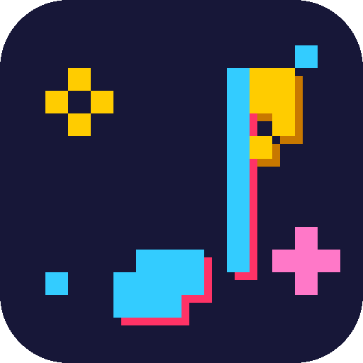

<div align="center">



# PIXELTIFY


[](https://github.com/hotcakes-py/pixeltify/releases)
[](https://github.com/hotcakes-py/pixeltify/releases)
[](https://github.com/hotcakes-py/pixeltify/releases)

</div>

## Qué es

Un reproductor de música de escritorio con estética pixel art, para Windows y Linux. Buscas una canción y te salen varias opciones sin duplicados, le das clic y suena al momento sin descargar. Si te gusta la bajas en MP3 y se queda guardada en tu biblioteca y en tus playlists aunque cierres la app. Aprende de lo que escuchas y te recomienda música, y puedes ver el perfil de cada artista con su top.

Todo funciona con yt-dlp y ffmpeg que ya vienen incluidos en la app, no hay que instalar nada más. Tu biblioteca, playlists, likes e historial viven en tu propio equipo.

## Dónde queda tu música

Junto al exe (o AppImage) se crea la carpeta `playlist`. Cada playlist que creas es una subcarpeta con ese nombre, y adentro van sus canciones: el MP3, su portada y sus datos (título, artista, álbum). Lo que guardas en ME GUSTA se descarga solo a su carpeta. Con el botón ABRIR CARPETA de cada playlist la ves directo en tu explorador.

## Descargar

Todo está en [releases](https://github.com/hotcakes-py/pixeltify/releases): el AppImage para Linux (doble clic y corre) y el zip para Windows (descomprimir y abrir el exe).

## Correr el código

```bash
npm install
npm run electron:dev   # app en desarrollo
npm run dist:linux     # AppImage + deb en release/
```
